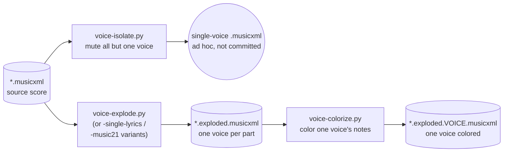
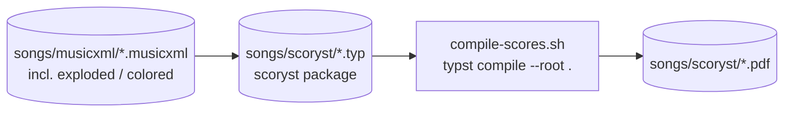
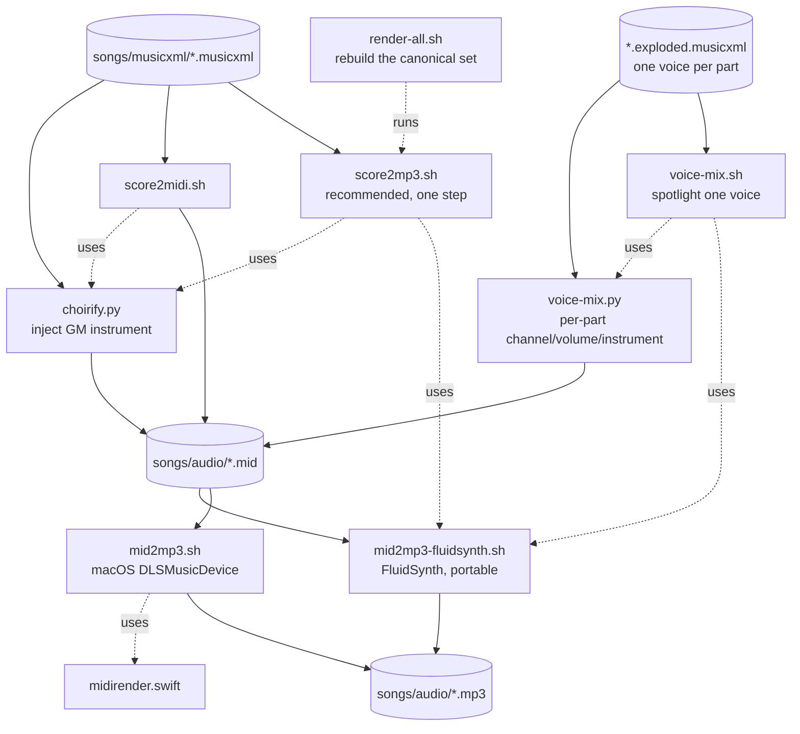

# Tools → songs/ pipeline

How the scripts in `tools/` turn the MusicXML sources in `songs/musicxml/`
into the notation PDFs in `songs/scoryst/` and the MIDI/MP3 files in
`songs/audio/`. See `tools/README.md` for full CLI usage of every tool
mentioned here.

Legend: cylinders are file groups (an artifact directory or glob), rectangles
are scripts/programs, solid arrows are "produces/reads", dotted arrows are
"internally calls" (not a separate data-flow step).

## 1. MusicXML → MusicXML (voice-level preprocessing)

Optional preprocessing tools that read a score and write a *derived*
MusicXML file -- used to prepare per-voice practice material before it goes
into either the notation or audio pipeline below.

`voice-explode.py` splits a part carrying multiple `<voice>`s on one staff
(e.g. Soprano/Alto sharing a treble stave) into one part per voice --
required before `voice-mix.py`/`voice-mix.sh` (below) can give each voice
its own MIDI channel. `voice-colorize.py` then highlights one of those parts
in red for visual study; `voice-isolate.py` instead mutes every voice but
one, for a quick rehearsal-track listen via the audio pipeline.

## 2. Notation: MusicXML → PDF

Each `.typ` file `read()`s a MusicXML sibling and renders it via the
`scoryst` Typst package (a Verovio-to-SVG wrapper); `compile-scores.sh`
drives `typst compile` over some or all of `songs/scoryst/*.typ`.

## 3. Audio: MusicXML/MIDI → MP3

`choirify.py` injects a `<midi-instrument>` into a copy of the score (GM
program 1/piano by default); `score2midi.sh`/`score2mp3.sh` call it
internally only when `-p` is given, otherwise the instrument comes from
Verovio's own default. `voice-mix.py` does the same channel-assignment job
but per-part, so a spotlighted voice can get its own volume and instrument
independent of the rest -- `voice-mix.sh` wraps it with the FluidSynth
render, and needs `four-voices.exploded.musicxml`-style input (§1) to have
one voice per part. `render-all.sh` just batches `score2mp3.sh` over every
piece (piano) and the choral pieces (choir), and does not touch the
per-voice spotlight tools.

## Out of scope

`songs/lilypond/`, `songs/lilypond-svg/`, and `songs/typed-scores/` hold
earlier, hand-run experiments (LilyPond engraving, then LilyPond-SVG-in-Typst)
that predate the `scoryst`-based pipeline above. No script in `tools/`
reads or writes them.
